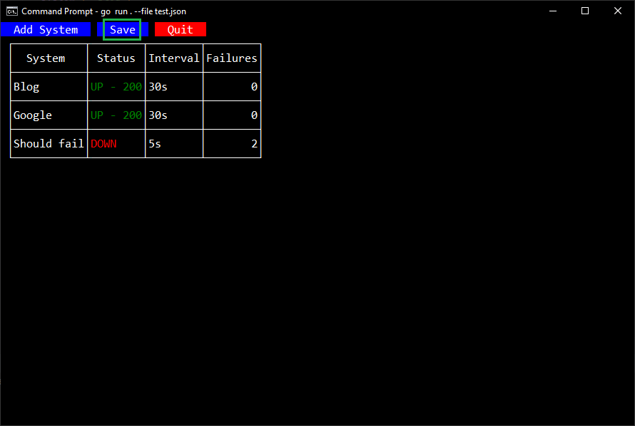

# Syspoll

This is a self-contained, CUI application that will poll one or more resources for liveness by sending HTTP requests (I plan to add socket polling as well).
This is accomplished using the excellent, cgo-free [tview](https://github.com/rivo/tview) library.

If you find this useful, make sure you stop over [there](https://github.com/rivo/tview) and show `rivo` some love. ;)

## CLI flags

Try `syspoll --help` for details for your version, here's the description shown for the latest version.

```text
Usage of syspoll:
      --file string   Load a polling spec from file
      --template      Export a template polling spec
```

## Polling spec

The user may specify attributes of the system to test or the check used to test liveness.
This is a JSON file with the following structure (this is also the output of `syspoll --template`).

```json
[
  {
    "system": "Descriptive name",
    "interval": "30s",
    "http": {
      "url": "https://google.com"
    }
  }
]
```

| Field          | Description                                                                                                                                   |
|----------------|-----------------------------------------------------------------------------------------------------------------------------------------------|
| `system`       | A descriptive name for the system that will appear in the system table                                                                        |
| `interval`     | A [time.Duration](https://pkg.go.dev/time#ParseDuration) string that will determine how often the polling check is performed                  |
| `http`         | Describes an HTTP request used as a polling check                                                                                             |
| `http.url`     | The URL target. It is expected to return a 2xx/3xx response code                                                                              |
| `failedChecks` | Not emitted when empty, or as a result of `--template`. This will contain a list of failure events if any have occurred when the run is saved |

### Adding Checks

A new system may be added at runtime with the button above the system table.

> **Note:** This dialog will also appear if there are no specs loaded with `--file` when the application starts.


### Saving Results

The results of a `syspoll` session (including adding new systems) may be saved to a file for later use.
So if you're not a fan of hand-editing JSON, then you're in luck.

Click on the "Save" button at the top, enter the file you wish to output the running state to, and click "Save".

> **Note:** Only failures are reported, and loading the resulting file will ignore any failure information.




Here's some example output:

```json
[
  {
    "system": "Blog",
    "interval": "30s",
    "http": {
      "url": "https://saylorsolutions.com"
    }
  },
  {
    "system": "Google",
    "interval": "30s",
    "http": {
      "url": "https://google.com"
    }
  },
  {
    "system": "Should fail",
    "interval": "5s",
    "failedChecks": [
      {
        "type": "down",
        "time": "2022-06-12T14:03:04.8753096-05:00"
      },
      {
        "type": "down",
        "time": "2022-06-12T14:03:09.9677708-05:00"
      }
    ],
    "http": {
      "url": "https://blurbadurben.io"
    }
  }
]
```

## Exiting the application

This can be done by either clicking the "Quit" button at the top, or by pressing ^C (Ctrl + C).
